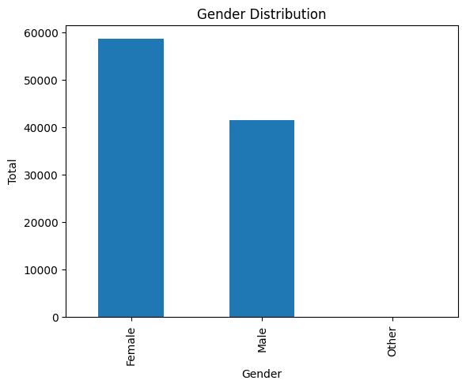
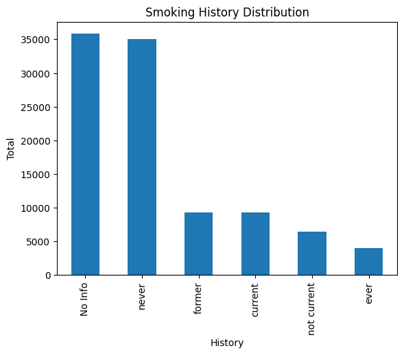
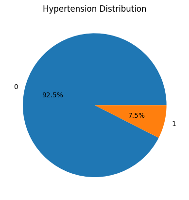
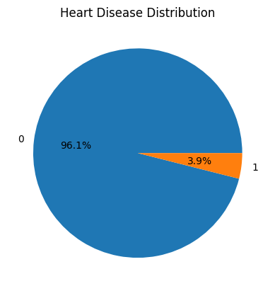
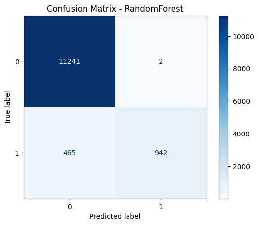
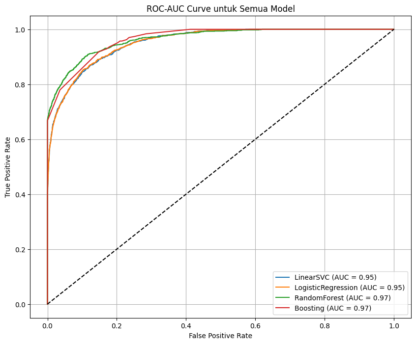

# Machine Learning Project Report - Kevin Juan Carlos

## Project Domain
Diabetes is the one global chronic disease that will have an impact on life quality and premature death. Based on research conducted by Takashima *et al*. (2024) in *Journal of Epidemiology*, diabetes significantly reduces healthy life expectancy in Japan—both men and women—and is categorized as influenced by risk factors such as blood pressure, body mass index (BMI), and smoking habits. According to the American Diabetes Association by Wild *et al*. (2004), diabetes prevalence sharply increases when people get older, making the older generation more vulnerable to this disease. Moreover, gender also plays a crucial role in the development of diabetes, as biological and hormonal differences contribute to variations in how men and women experience chronic illnesses such as diabetes (Regitz-Zagrosek, 2012). For example, men are more likely to develop diabetes at lower BMI values, while women with hormonal conditions like PCOS are at higher risk. This fact shows that diabetes cannot only cause physical complications but also shorten a person's disability lifespan. Therefore, early detection and intervention are even more essential to maintaining the quality of the community. Advancements in technology have enabled the utilization of Artificial Intelligence, particularly Machine Learning, which can be applied to predict the probability of people having diabetes based on their medical data. This project focuses on predictive analytics and aims to compare Machine Learning model classification to know what models can make the diagnosis process efficient and accurate.

## Business Understanding
### Problem Statements
- How to predict diabetes risks based on the factors which are blood pressure, body mass index (BMI), smoking habits, age and gender?
- How to use Machine Learning for increasing the accuracy to detect the diabetes risks?
- What the most effective algorithm for analyze medical data and predict the probability of people who have diabetes and how these models can improve efficiency for diagnosis process?

### Goals
- Indentify and understand the main risk factors (blood pressure, body mass index (BMI), smoking habits, age and gender) that can influence diabetes prediction and how they can be used on Machine Learning model for accurate diagnosis.
- Build prediction model using medical data and risks factors to give early diagnosis that more efficient and accurate.
- Compare each Machine Learning algorithm to knowing which one can give high accuracy to predict diabetes risk, and optimalize model to get the better result.

### Solution Statements
- Comparing four different Machine Learning algorithms which are Linear Support Vector Classifier (LinearSVC), Linear Regression, Random Forest, and AdaBoost.
- Data preprocessing is done to make sure the input model quality and model can work optimally.
- Doing hyperparameter tuning to find the best parameter combinations and optimize performance for each model using GridSearchCV and RandomizedSearchCV.  

## Data Understanding
### Source
The dataset used in this project was obtained from [Kaggle](https://www.kaggle.com/datasets/iammustafatz/diabetes-prediction-dataset) with the name "Diabetes Prediction Dataset". It can be downloaded using kagglehub library with the following code:
```
import kagglehub

path = kagglehub.dataset_download("iammustafatz/diabetes-prediction-dataset")
```

### Dataset Information
This dataset consists of 100000 entries before data cleaning and is designed to predict the likelihood of someone having diabetes based on the features and lifestyle factors. The dataset includes nine features, one of which is the target label Diabetes, with values defined as follows: 
- 1 = diabetes
- 0 = non-diabetes

### Data Condition
- There are no missing values
- Have 3854 data duplication
- Data imbalance

The dataset consists of eight input features and one target label, which are as follows:
- Age: The range starts from 0 and goes up to 80.
- Gender: Consist of three categories which are male, female, and other.
- Body Mass Index (BMI): The range of BMI in the dataset is from 10.16 to 71.55. (Underweight (BMI < 18.5),  Normal (18.5 ≤ BMI < 24.9), Overweight (25 ≤ BMI < 29.9), and Obese (BMI ≥ 30)).
- Hypertension: It has values of 0 or 1 where 0 indicates indicates they don’t have hypertension and 1 means they have hypertension.
- Heart Disease: It has values of 0 or 1 where 0 indicates they don’t have heart disease and 1 means they have heart disease.
- Smoking History: Consists of five categories which are not current, former, no info, current, never, and ever.
- HbA1c Level: A measure of a person's average blood sugar level over the past 2-3 months, higher levels indicate a greater risk of developing diabetes.
- Blood Glucose Level: Refers to the amount of glucose in the bloodstream at a given time, high levels are a key indicator of diabetes.
- Diabetes: The target variable being predicted, 1 indicates the presence of diabetes and 0 indicates the absence of diabetes.

### Datatypes Overview
This part explained datatypes from each column (features) on dataset. Datatype shows how data stored and processed, example is the data in number (integer, float), text (object), or categorical and also this is become basic foundation to create a better machine learning model. 
| Column               | Non-Null Count | Dtype   |
|----------------------|----------------|---------|
| gender               | 100,000        | object  |
| age                  | 100,000        | float64 |
| hypertension         | 100,000        | int64   |
| heart_disease        | 100,000        | int64   |
| smoking_history      | 100,000        | object  |
| bmi                  | 100,000        | float64 |
| HbA1c_level          | 100,000        | float64 |
| blood_glucose_level  | 100,000        | int64   |
| diabetes             | 100,000        | int64   |

### Datasets Statistic Descriptive
This part displays the statistical summary of each column on the dataset's numeric features.
| Statistic | age       | hypertension | heart_disease  | bmi       | HbA1c_level | blood_glucose_level  | diabetes |
|-----------|-----------|--------------|----------------|-----------|-------------|----------------------|----------|
| count     | 100000.00 | 100000.00    | 100000.00      | 100000.00 | 100000.00   | 100000.00            | 100000.00|
| mean      | 41.89     | 0.07         | 0.04           | 27.32     | 5.53        | 138.06               | 0.09     |
| std       | 22.52     | 0.26         | 0.19           | 6.64      | 1.07        | 40.71                | 0.28     |
| min       | 0.08      | 0.00         | 0.00           | 10.01     | 3.50        | 80.00                | 0.00     |
| 25%       | 24.00     | 0.00         | 0.00           | 23.63     | 4.80        | 100.00               | 0.00     |
| 50%       | 43.00     | 0.00         | 0.00           | 27.32     | 5.80        | 140.00               | 0.00     |
| 75%       | 60.00     | 0.00         | 0.00           | 29.58     | 6.20        | 159.00               | 0.00     |
| max       | 80.00     | 1.00         | 1.00           | 95.69     | 9.00        | 300.00               | 1.00     |

### Data Distribution Visualization
This part presenting the visualization using bar chart or pie chart from distribution in each categorical feature.

- #### Bar Chart for Gender Distribution


This histogram shows that the number of females (approximately 60%) significantly exceeds the number of males (approximately 40%). Additionally, there is a small number of 'Other' labels, and it doesn't provide significant insight for modelling. For this reason, it might be removed from the dataset to simplify the analysis and help reduce noise and increase model interpretability. After removal, the data remains well-distributed between males and females, eliminating the need for additional balancing.

- #### Bar Chart for Smoking History Distribution


This histogram shows that the majority of data for 'No Info' labels (approximately 70%), 'Never' labels (approximately 70%), and the other label that represents a relatively small portion of data is distributed among the categories 'former', 'current', 'not current', and 'ever' (approximately 30%). Since the 'Never' labels are still essential for the analysis, it should be retained. However, the 'No Info' labels lack of interpretive value, it can removed to eliminate noise and enhance data quality. After doing this preprocessing, it could help to achieve a more balanced distribution, improved model performance, and interpretability.

- #### Pie Chart for Hypertension Distribution


This histogram shows that 92.5% of the data corresponds to individuals without hypertension (label 0), while 7.5% represent those with hypertension (label 1). The data distribution is similar to the heart disease dataset, where there is an imbalance in the classes. Although the imbalance is not as severe as in heart disease, it is still important to consider balancing techniques or methods more robust to data imbalance, such as XGBoost or Balanced Random Forest, to improve model performance and ensure more reliable predictions.

- #### Pie Chart for Heart Disease Distribution


This pie chart shows that the majority of data for individuals without heart disease (label 0) comprises approximately 96.1%, while the remaining 3.9% represents individuals with heart disease (label 1). Since the 'No heart disease' labels are more prevalent, they dominate the dataset. However, the 'Heart disease' labels, though representing a smaller portion of the data, are crucial for the analysis. To address this imbalance, techniques like oversampling (SMOTE), undersampling, or class weighting should be applied to improve the distribution. After preprocessing, these steps could lead to a more balanced dataset, improving model performance and interpretability.

## Data Preparation
This step is crucial to ensure that the dataset is clean, consistent, and suitable for machine learning algorithms. The following techniques were applied in the notebook, in the order they were executed:
### Dropping Duplicate Records
Duplicate rows in the dataset can skew the model by overrepresenting certain patterns. To ensure that each instance in the training data is unique and to prevent bias and overfitting, duplicate entries were identified and removed.
  
### Removing Irrelevant Values
Some values in the dataset may be irrelevant or too rare to contribute meaningful statistical insight. These values were examined and removed to improve data quality and model learning efficiency.
  
### Label Encoding
Categorical features such as `gender` and `smoking_history` were encoded using **Label Encoding**, converting string labels into numeric form. This step is necessary because most machine learning algorithms require numerical input. Label encoding allows these categorical features to be used effectively in the modeling process while preserving ordinal relationships, if any.

### Outliers handling
Outliers in numerical features like `age`, `bmi`, `HbA1c_level`, and `blood_glucose_level` were detected and treated using the **Interquartile Range (IQR)** method. Outliers can introduce noise and distort the learning process, reducing model accuracy. By managing these outliers, the model’s generalization performance is improved.

### Spliting the Dataset
Before training the model, the dataset was divided into training and testing sets. To ensure reliable evaluation, 20% of the data was set aside for testing. The split was stratified based on the target variable (diabetes) to maintain the same class distribution in both training and testing sets, which is particularly important when dealing with imbalanced data. Additionally, a fixed random state was used during the split to make the results reproducible, allowing for consistent outcomes when running the model multiple times.

### Standardization
Numerical features such as `age`, `bmi`, `HbA1c_level`, and `blood_glucose_level` were transformed using StandardScaler. Standardization ensures that the data has a mean of 0 and a standard deviation of 1, rather than scaling the values to a range between 0 and 1. This is particularly important for gradient-based optimization algorithms like Logistic Regression, as standardized data can accelerate convergence.
  
Each of these steps plays a vital role in transforming the raw data into a structured and clean form, enabling the machine learning model to learn patterns effectively and make accurate predictions.

## Modeling
To solve the classification problem of predicting diabetes, we experimented with four different machine learning models. Each model underwent hyperparameter tuning using GridSearchCV to achieve optimal performance. Below is a detailed explanation of the modeling process, evaluation, and reasoning behind the model selection.
### Models Used:
- #### Linear Support Vector Classifier (LinearSVC)
works by finding a hyperplane that best separates the data into two classes while maximizing the margin between them. This approach is particularly effective for high-dimensional datasets. We tuned two key hyperparameters: C, which controls the regularization strength (with lower values indicating stronger regularization), and max_iter, which sets the maximum number of iterations to ensure the algorithm converges. The tested values for C were [0.01, 0.1, 1, 10], and for max_iter were [1000, 2000]. The advantage of LinearSVC is its efficiency when handling high-dimensional data, and it trains relatively fast on smaller datasets. However, it assumes that the data is linearly separable and is sensitive to unscaled or noisy data.

- #### Logistic Regression
predicts class membership probabilities using a logistic function, making it suitable for binary classification tasks. The hyperparameters tuned for Logistic Regression were C, which is the inverse of regularization strength, and solver, which determines the optimization algorithm used. The values tested for C were [0.01, 0.1, 1, 10], while the solver options included 'liblinear' and 'lbfgs'. Logistic Regression is simple, easy to interpret, and serves well as a baseline model, especially when proper regularization is applied. However, it assumes a linear relationship between features and the target, which can be limiting when dealing with non-linear data distributions.

- #### Random Forest
works by constructing a large number of decision trees during training and outputting the most common class as the final prediction. This method captures complex relationships and feature interactions effectively. The key hyperparameters tuned were n_estimators (number of trees), max_depth (maximum depth of each tree), and min_samples_split (minimum samples required to split a node). We experimented with n_estimators values of [50, 100, 150], max_depth values of [10, 16, 20], and min_samples_split values of [2, 5]. The strength of Random Forest lies in its ability to handle non-linear relationships and feature interactions, making it robust to outliers and missing values. However, it can be slower to train when using a large number of trees and is generally harder to interpret compared to linear models.

- #### AdaBoost Classifier
combines multiple weak classifiers (typically decision trees) to build a stronger predictive model. The model iteratively focuses on instances that are harder to classify correctly. The hyperparameters tuned were n_estimators, representing the number of boosting stages, and learning_rate, which reduces the weight of each weak learner’s contribution. The tested values for n_estimators were [50, 100, 200], and for learning_rate, they were [0.001, 0.01, 0.1]. AdaBoost is particularly useful when dealing with imbalanced datasets and often yields improved accuracy by combining weak learners. However, it can be sensitive to noisy data and outliers, and if not tuned properly, it may overfit.

After evaluating all models, we summarized their performance as follows: LinearSVC achieved a training accuracy of 94.81% and a test accuracy of 94.73%, while Logistic Regression achieved 94.76% training accuracy and 94.71% test accuracy. Random Forest performed the best, with 96.38% training accuracy and 96.31% test accuracy, followed closely by AdaBoost, which had 96.27% training accuracy and 96.30% test accuracy.

### Model Performance Summary:
| Model               | Train Accuracy | Test Accuracy |
|--------------------|----------------|----------------|
| LinearSVC          | 0.9481         | 0.9473         |
| LogisticRegression | 0.9476         | 0.9471         |
| RandomForest       | 0.9638         | 0.9631         |
| Boosting (AdaBoost)| 0.9627         | 0.9630         |

In conclusion, the Random Forest model was chosen as the final solution due to its superior performance, robust handling of both numerical and categorical features, and minimal overfitting. Its ability to capture complex patterns without requiring feature scaling made it the most suitable model for this classification problem. The close performance of AdaBoost also indicated that boosting techniques are effective, especially in managing imbalanced data.

## Evaluation
### Classification Report
This report presents the evaluation metrics of each model's performance by summarizing the following: 
- **Precision**: Measures the accuracy of positive predictions made by the model. This metric indicates the proportion of correctly predicted positive instances out of all predicted as positive.
- **Recall**: Measures the ability of the model to identify positive instances. This metric indicates how many propositions from all of the positive examples that successfully detected by the model.
- **F1-score**: The harmonic mean of both precision and recall, balancing both metrics into a single value. It's useful when dealing with a dataset that has an imbalanced class distribution.
- **Support**: The number of actual instances of each class in the dataset gives a view of the class proportion that was evaluated. Therefore, we can understand the data distribution on that model.

Here are the results of the comparison analysis from each model:
- #### LinearSVC

```
              precision    recall  f1-score   support

           0       0.95      0.99      0.97     11243
           1       0.87      0.62      0.72      1407

    accuracy                           0.95     12650
   macro avg       0.91      0.80      0.85     12650
weighted avg       0.94      0.95      0.94     12650
```
Based on this evaluation result, Class 0 (Non-diabetes) demonstrates 95% Precision, indicating it correctly predicted the non-diabetes case. Additionally, the Recall for the same class is 99%, meaning that the model accurately identified 99% of all non-diabetes instances, and the F1-Score for this class is 97%, which indicates a strong performance in identifying non-diabetes cases. For Class 1 (Diabetes), demonstrate 87% for the Precision, signifying it predict cases were correct. However, the Recall was 62%, indicating that the model was able to identify only 62% of the actual diabetes cases. Class 1 F1-Score demonstrates 72%, which shows a balanced measure of Precision and Recall, though it is relatively lower compared to Class 0. Overall, the model achieved an accuracy of 95%, a macro average F1-Score of 0.85, and a weighted average F1-Score of 0.94, highlighting its effectiveness in identifying non-diabetes cases while showing some limitations in correctly detecting diabetes.

- #### Logistic Regression

```
              precision    recall  f1-score   support

           0       0.96      0.99      0.97     11243
           1       0.85      0.63      0.73      1407

    accuracy                           0.95     12650
   macro avg       0.90      0.81      0.85     12650
weighted avg       0.94      0.95      0.94     12650
```
Similar to LinearSVC, Logistic Regression also performs well in classifying Class 0 (Non-diabetes) cases, achieving 96% for Precision, indicating it correctly predicted the non-diabetes case. Additionally, the Recall was also notably high at 99%, meaning the model successfully identified all Class 0 (Non-diabetes) instances. The F1-Score for this class is 97%, reflecting a strong balance between Precision and Recall. Class 1 (Diabetes) shows a precision of 85% of the predicted diabetes cases being accurate. The Recall for class 1 (Diabetes) is 63%, which is slightly better than LinearSVC's Recall of 62%, indicating that the model was able to accurately detect 63% of the real diabetes cases. The F1-score for this class is 73%, indicating an improved balance between precision and recall compared to LinearSVC. Overall, the model achieved an accuracy of 95%, a macro average F1-score of 0.85, and a weighted average F1-score of 0.94.

#### Random Forest

```
              precision    recall  f1-score   support

           0       0.96      1.00      0.98     11243
           1       1.00      0.67      0.80      1407

    accuracy                           0.96     12650
   macro avg       0.98      0.83      0.89     12650
weighted avg       0.96      0.96      0.96     12650
```

- **Precision for Class 0**: 96%, showing it makes accurate predictions for non-diabetes.
- **Recall for Class 0**: 100%, demonstrating that Random Forest correctly identifies all non-diabetes cases.
- **Precision for Class 1**: 100%, which is excellent, but this comes at the cost of lower recall (67%) for diabetes. This means Random Forest is more confident when predicting diabetes, but it may miss some cases.

#### AdaBoost (Boosting)


```
              precision    recall  f1-score   support

           0       0.96      1.00      0.98     11243
           1       1.00      0.67      0.80      1407

    accuracy                           0.96     12650
   macro avg       0.98      0.83      0.89     12650
weighted avg       0.96      0.96      0.96     12650
```

- AdaBoost also shows very high precision for non-diabetes (96%) and perfect recall for non-diabetes (100%).
- Similar to Random Forest, it shows a high precision (100%) for diabetes, but lower recall (67%).

### Confusion Matrix

The **confusion matrix** helps visualize the performance of a classification model by displaying the true positives (TP), false positives (FP), true negatives (TN), and false negatives (FN).

- **True Positive (TP)**: Correctly predicted positive outcomes (diabetes).
- **False Positive (FP)**: Incorrectly predicted positive outcomes (non-diabetes predicted as diabetes).
- **True Negative (TN)**: Correctly predicted negative outcomes (non-diabetes).
- **False Negative (FN)**: Incorrectly predicted negative outcomes (diabetes predicted as non-diabetes).

**Confusion matrices** provide insights into the type of errors each model makes and are crucial for understanding trade-offs between precision and recall.

- **LinearSVC Confusion Matrix**
  
  
  
- **Logistic Regression Confusion Matrix**
  
  
  
- **Random Forest Confusion Matrix**
  
  
  
- **AdaBoost Confusion Matrix**
  
  

### ROC-AUC

The **ROC-AUC (Receiver Operating Characteristic - Area Under Curve)** is a performance measurement for classification problems. It shows the trade-off between **True Positive Rate (Recall)** and **False Positive Rate** across different thresholds.

- **ROC Curve**: A plot of the true positive rate (recall) against the false positive rate.
- **AUC (Area Under Curve)**: A measure of how well the model distinguishes between classes. The higher the AUC, the better the model’s ability to differentiate between the positive and negative classes.



## References
Wild, S., Roglic, G., Green, A., Sicree, R., & King, H. (2004). Global prevalence of diabetes. Diabetes Care, 27(5), 1047–1053. https://doi.org/10.2337/diacare.27.5.1047

Regitz-Zagrosek, V. (2012). Sex and gender differences in health. EMBO Reports, 13(7), 596–603. https://doi.org/10.1038/embor.2012.87

Tsukinoki, R., Murakami, Y., Hayakawa, T., Kadota, A., Harada, A., Kita, Y., Okayama, A., Miura, K., Okamura, T., & Ueshima, H. (2025). Comprehensive assessment of the impact of blood pressure, body mass index, smoking, and diabetes on healthy life expectancy in Japan: NIPPON DATA90. Journal of Epidemiology. https://doi.org/10.2188/jea.je20240298
